# AUIB VMS — Detailed Architecture & Flows

This file contains a very detailed, easy-to-understand flowchart (Mermaid) of the AUIB Volunteers Management System (VMS). Save and open this file in VS Code.
{
  "markdown.styles": [
    "./.vscode/markdown-custom.css"
  ]
}

(See https://code.visualstudio.com/Docs/languages/markdown#_using-your-own-css)

Mermaid flowchart

```mermaid
flowchart TB
  %% Simplified, parser-safe diagram
  subgraph APP[Application]
    direction TB
    A_CREATE[create_app]
    A_CONFIG[load config]
    A_DB[init db]
    A_LOGIN[init login manager]
    A_BP[register blueprints]
    A_MAIL[init mail optional]
    A_CREATE --> A_CONFIG
    A_CONFIG --> A_DB
    A_CREATE --> A_LOGIN
    A_CREATE --> A_BP
    A_CREATE --> A_MAIL
  end

  subgraph DB[Models]
    direction TB
    U[User]
    E[Event]
    T[TimeLog]
    B[BulkSubmission]
    EL[EmailLog]
    S[Setting]
    SA[SettingAudit]
    U --> E
    E --> T
    B --> T
  end

  subgraph AUTH[Auth]
    direction TB
    AUTH_LOGIN[POST /login]
    AUTH_HOME[GET home]
    AUTH_FORGOT[POST forgot]
    AUTH_RESET[GET/POST reset]
  end

  subgraph OFFICER[Officer]
    direction TB
    O_CREATE[create_event]
    O_PARSE[file parse]
    O_EVENT[event record]
    O_JWT[generate JWT links]
    O_SEND[send emails]
    O_APPROVE[approve bulk]
    O_TIMELOGS[review timelogs]
    O_REPORTS[generate reports]
  end

  subgraph CLUB[Club Leader]
    direction TB
    C_SUBMIT[submit_hours]
    C_PARSE[parse JSON hours]
    C_BULK[create BulkSubmission]
  end

  subgraph LOG[Volunteer Log]
    direction TB
    L_VIEW[open link]
    L_DECODE[decode token]
    L_ACTION[start/stop]
    L_TIMelog[create/update TimeLog]
  end

  subgraph EMAIL[Email Subsystem]
    direction TB
    E_QUEUE[record queued logs]
    E_MAILMAN[use Mailman if present]
    E_SMTP[SMTP fallback]
    E_RESULT[record sent or failed]
  end

  subgraph ADMIN[Admin]
    direction TB
    AD_VIEW[view settings]
    AD_SAVE[save settings]
    AD_TEST[test mail]
    AD_USERS[manage users]
    AD_EMAILS[view email logs]
  end

  %% Connections
  A_DB --> U
  O_SEND --> E_QUEUE
  E_SMTP --> E_RESULT
  L_TIMelog --> T
  C_BULK --> O_APPROVE
  AD_SAVE --> S

  %% Styles
  style APP fill:#f3f4f6,stroke:#9ca3af
  style DB fill:#fff7ed,stroke:#f59e0b
  style AUTH fill:#eef2ff,stroke:#6366f1
  style OFFICER fill:#ecfdf5,stroke:#10b981
  style CLUB fill:#fff7f0,stroke:#fb923c
  style LOG fill:#fff1f2,stroke:#ef4444
  style EMAIL fill:#f0f9ff,stroke:#3b82f6
  style ADMIN fill:#fefce8,stroke:#eab308
```

