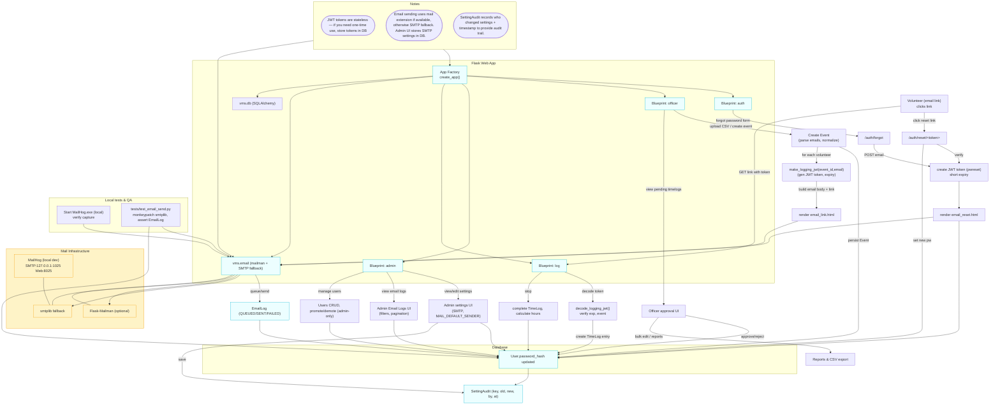

# AUIB VMS — System Flowchart

This file contains the main Mermaid diagram for the VMS project. Open it in an editor with Markdown Preview Mermaid Support to render.

```mermaid
flowchart TB
  subgraph WebApp[Flask Web App]
    direction TB
    App["App Factory<br/>create_app()"]
    AuthBP["Blueprint: auth"]
    OfficerBP["Blueprint: officer"]
    AdminBP["Blueprint: admin"]
    LogBP["Blueprint: log"]
    EmailModule["vms.email (mailman + SMTP fallback)"]
  DBWrapper["vms.db (SQLAlchemy)"]
    App --> AuthBP
    App --> OfficerBP
    App --> AdminBP
    App --> LogBP
    App --> EmailModule
    App --> DBWrapper
  end

  subgraph Persistence[Database]
    direction LR
    SQL["SQLite / SQLAlchemy<br/>(models: User, Event, TimeLog, EmailLog, Setting, SettingAudit)"]
  end

  subgraph MailInfra[Mail Infrastructure]
    direction TB
    MailExt["Flask-Mailman (optional)"]
    SMTP["smtplib fallback"]
    MailHog["MailHog (local dev)<br/>SMTP:127.0.0.1:1025 Web:8025"]
    MailExt --- EmailModule
    SMTP --- EmailModule
    MailHog --- SMTP
  end

  %% Event creation & per-volunteer link generation
  OfficerBP -->|upload CSV / create event| OfficerCreate["Create Event<br/>(parse emails, normalize)"]
  OfficerCreate -->|persist Event| SQL
  OfficerCreate -->|for each volunteer| MakeJWT["make_logging_jwt(event_id,email)<br/>(gen JWT token, expiry)"]
  MakeJWT -->|build email body + link| RenderEmail["render email_link.html"]
  RenderEmail --> EmailModule
  EmailModule -->|queue/send| SQL_EmailQueue["EmailLog (QUEUED/SENT/FAILED)"]
  EmailModule --> SMTP
  EmailModule --> MailExt

  %% Volunteer sign-in via JWT link
  Volunteer["Volunteer (email link)<br/>clicks link"] -->|GET link with token| LogBP
  LogBP -->|decode token| DecodeJWT["decode_logging_jwt()<br/>verify exp, event"]
  DecodeJWT -->|create TimeLog entry| SQL["TimeLog (PENDING)"]
  LogBP -->|stop| UpdateTime["complete TimeLog, calculate hours"]
  UpdateTime --> SQL

  %% Officer approval flow
  OfficerBP -->|view pending timelogs| PendingView["Officer approval UI"]
  PendingView -->|approve/reject| SQL
  PendingView -->|bulk edit / reports| Reports["Reports & CSV export"]

  %% Admin & settings
  AdminBP -->|view/edit settings| SettingsUI["Admin settings UI<br/>(SMTP, MAIL_DEFAULT_SENDER)"]
  SettingsUI --> SQL["Setting rows"]
  SettingsUI -->|save| SettingAudit["SettingAudit (key, old, new, by, at)"]
  AdminBP -->|view email logs| EmailLogsUI["Admin Email Logs UI<br/>(filters, pagination)"]
  EmailLogsUI --> SQL
  AdminBP -->|manage users| UsersUI["Users CRUD, promote/demote (admin-only)"]
  UsersUI --> SQL

  %% Password reset flow
  AuthBP -->|forgot password form| ForgotForm["/auth/forgot"]
  ForgotForm -->|POST email| GenerateReset["create JWT token (pwreset)<br/>short expiry"]
  GenerateReset --> RenderResetEmail["render email_reset.html"]
  RenderResetEmail --> EmailModule
  RenderResetEmail --> SQL
  Volunteer -->|click reset link| ResetRoute["/auth/reset/&lt;token&gt;"]
  ResetRoute -->|verify| GenerateReset
  ResetRoute -->|set new pw| SQL["User.password_hash updated"]

  %% Tests and local dev
  subgraph DevTests[Local tests & QA]
    direction TB
    ManualMailHog["Start MailHog.exe (local)<br/>verify capture"]
    UnitTests["tests/test_email_send.py<br/>monkeypatch smtplib, assert EmailLog"]
    ManualMailHog --> EmailModule
    UnitTests --> EmailModule
    UnitTests --> SQL
  end

  %% cross-connections
  SQL_EmailQueue --> SQL
  SQL --> SettingAudit

  classDef infra fill:#fef3c7,stroke:#f59e0b
  classDef core fill:#ecfeff,stroke:#06b6d4
  class App,AuthBP,OfficerBP,AdminBP,LogBP,EmailModule core
  class MailInfra,MailExt,SMTP,MailHog infra
  class SQL,SQL_EmailQueue,SettingAudit,SettingAudit core

  %% notes
  subgraph Notes[Notes]
    direction TB
    N1([JWT tokens are stateless — if you need one-time use, store tokens in DB])
    N2([Email sending uses mail extension if available, otherwise SMTP fallback. Admin UI stores SMTP settings in DB.])
    N3([SettingAudit records who changed settings + timestamp to provide audit trail.])
  end

  Notes --> App
  Notes --> EmailModule
```
